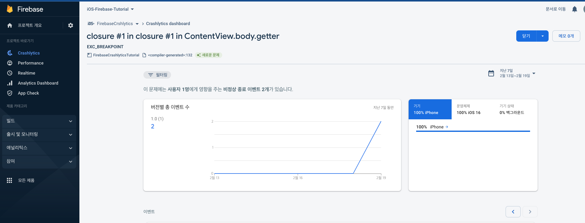

# FirebaseCrashlyticsTutorial
Firebase (Google에서 mobile application 개발을 돕기 위해 만든 toolset...)의 Crashlytics를 사용한 연습.
App에서 Crash가 일어나면 Firebase Project에 보고 된다.   
   

   

## 세팅 절차
- [App에 Firebase Project 등록](https://firebase.google.com/docs/crashlytics/get-started?platform=ios&authuser=0&hl=ko#set-up-dsym-uploading)
- Firebase Project에 App Bundle Identifier 전달.

## 종속성 (이걸 알지 못해 한참 헤맸음...)
- FirebaseAnalytics
- FirebaseCrashlytics

## TODO
- Firebase Crashlytics로 얻을 수 잇는 정보 확인.
- Firebase Crashlytics로 전달할 수 있는 정보 확인.
- App Store에 올라가 있는 App에서 Firebase Crashlytics를 설정하는 세팅 확인.
- dSyms 정보가 뭔지 확인.
- 보통 앱이 팅긴 경우 보고하기 문구가 떴던거 같은데 이것도 같이 확인.
